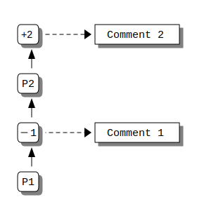

---
export_on_save:
  html: true

presentation:
  theme: beige.css
  width: 1280
  height: 960
---

<!-- slide -->
# Markdown Slides Template

Xinyu Ma

<!-- slide -->
### LaTeX math
Inline: $\{z\in x: \varphi(z)\}$
Block:
$$
\forall x\exists y\forall z[z\in y\leftrightarrow z\in x\wedge\varphi(z)]
$$

<!-- slide -->
### Mermaid diagram

<!-- slide -->
### Ditaa ASCII diagram

